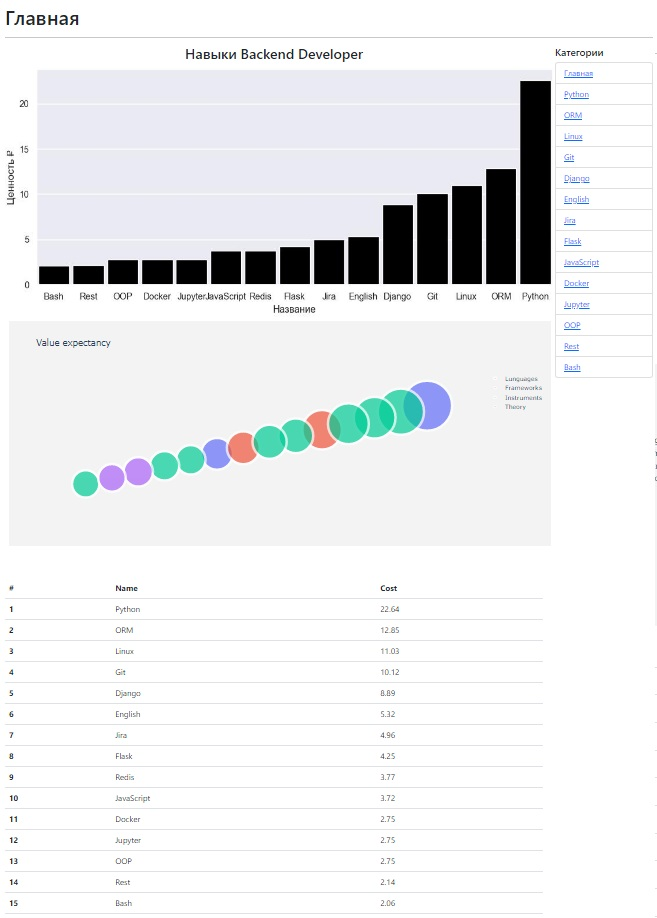
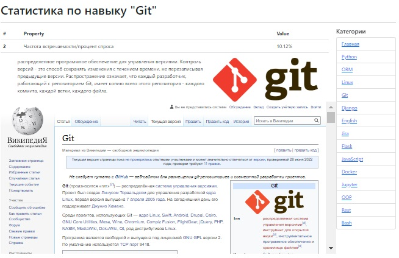

# developer_skills_analitics
web site with analitics for back-developer skills value in Russia in rubles
## Технологии
Использовали Flask, seaborn, dash, plotly. В процессе сбора и обработки данных pandas. на сайте используется поиск от гугл[^1].

[^1]: С поиском и условиями пользования можете ознакомится по [ссылке](https://developers.google.com/custom-search/v1/overview)


## Сайт с аналитикой


<hr></hr>


## Как запустить
1. Клонируем репозиторий

```comandline

git clone https://github.com/Phoolore/Flask.git

```

2. Создаем виртуальное окружение

```comandline

python -m venv vertualenv

```

3. Создаем виртуальное окружение

```comandline

vertualenv\scripts\activate

```

4. Устанавливаем зависимости(фреймворки, пакеты)

```comandline

pip install -r requirements.txt

```

5. Создаем файл .env и укажите настройки подключения к БД(sqlite и т.п.) и т.п.

```text

DATABASE_URI = sqlite:///db.sqlite3
SECRET_KEY = YOUR_SECRET_KEY
GOOGLE_API_KEY = YOUR_GOOGLE_API_KEY
GOOGLE_ENGINE_ID = YOUR_GOOGLE_ENGINE_ID

```
<details> 
<summary>Как получить GOOGLE_API_KEY и GOOGLE_ENGINE_ID</summary> 
 
1. Шаг 1: Создаем приложение для регистрации на него API_KEY и ENGINE_ID по [ссылке](https://console.cloud.google.com/projectcreate). 
2. Шаг 2: Регестрируем поисковую строку по  [ссылке](https://programmablesearchengine.google.com/controlpanel/all), в "Что искать?" выбираем "Поиск на определенных сайтах и веб-страницах" и в поле вводим "ru.wikipedia.org" без кавычек, нажимаем добавить справа от поля и создать внизу формы
3. Шаг 3: Вас перекидывает на страницу, где есть код html.
    ```html
    <script async src="https://cse.google.com/cse.js?cx=111a111aa11111a11">
    </script>
    <div class="gcse-search"></div>
    ```
4. Шаг 4: Копируем значения cx, в примере это 111a111aa11111a11, это и есть ENGINE_ID, записываем в .env вместо YOUR_GOOGLE_ENGINE_ID.
5. Шаг 5: Переходим по следующей [ссылке](https://developers.google.com/custom-search/v1/overview) и нажимаем на большую синюю кнопку с надписью "Get a Key". 
6. Шаг 6: Выбираем недавно созданный проект и нажимаем синюю кнопку справа снизу "Next". 
7. Шаг 7: В появившемся окошке после загрузки нажимаем синюю кнопку "SHOW KEY", это API_KEY, записываем в .env вместо YOUR_GOOGLE_API_KEY. 
 
</details>
6. Запустите flask приложение

```comandline

python -m flask run

```
