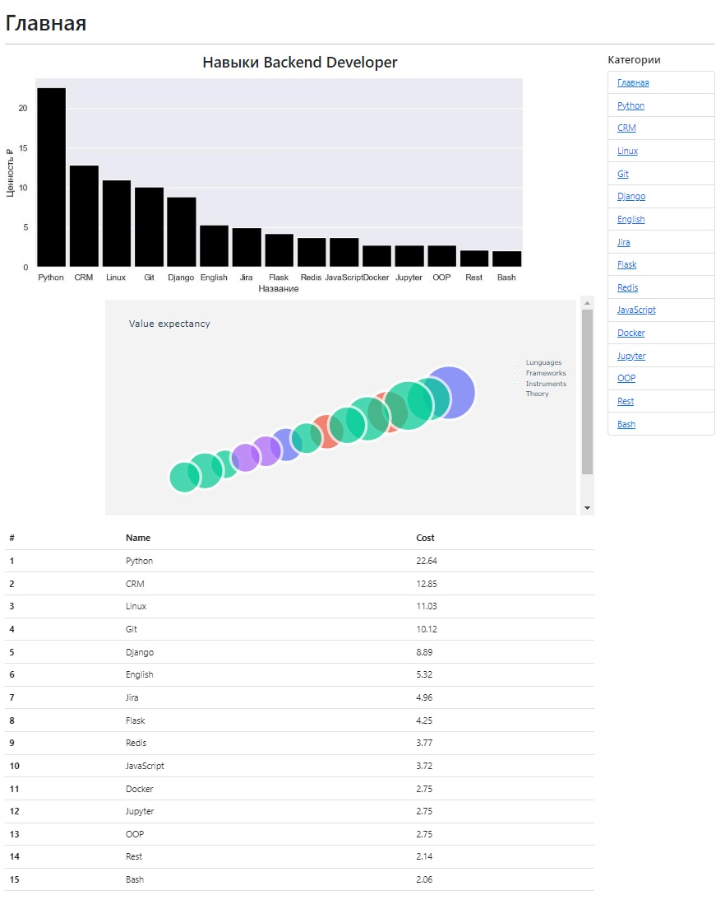
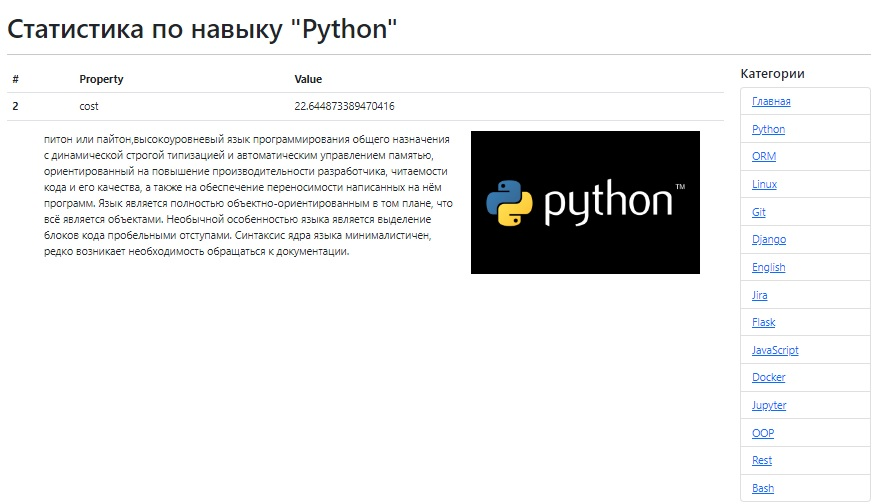

# developer_skills_analitics
web site with analitics for back-developer skills value in Russia in rubles
## Технологии
Использовали Flask, seaborn, dash, plotly. В процессе сбора и обработки данных pandas.

## Сайт с аналитикой

## Как запустить
1. Клонируем репозиторий

'''comandline

git clone https://github.com/Phoolore/Flask.git

'''

2. Создаем виртуальное окружение

'''comandline

'''

3. Устанавливаем зависимости(фреймворки, пакеты)

'''comandline

pip install -r requirements.txt

'''

4. Создаем файл .env и укажите настройки подключения к БД(sqlite и т.п.) и т.п.

'''.env

DATABASE_URI = sqlite:///db.sqlite3

SECRET_KEY = YOUR_SECRET_KEY

'''

5. Запустите flask приложение

'''comandline

python -m flask run

'''
